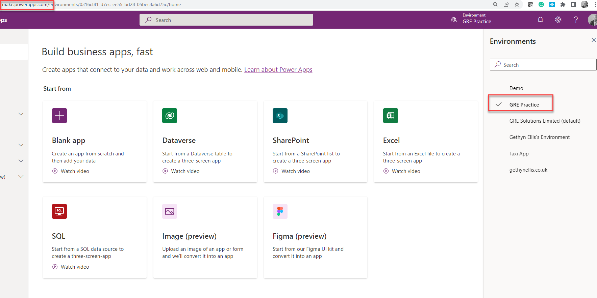
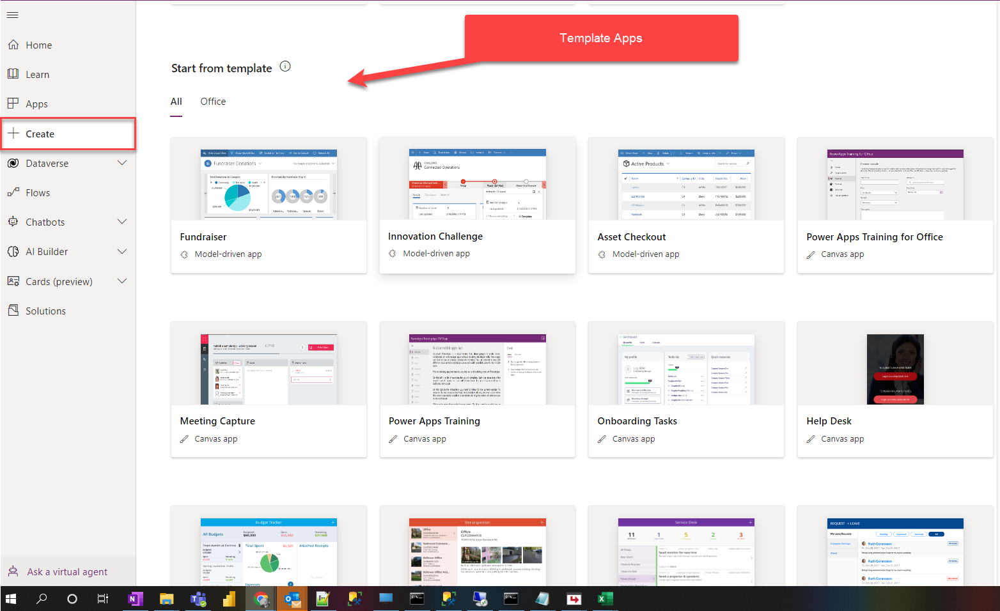
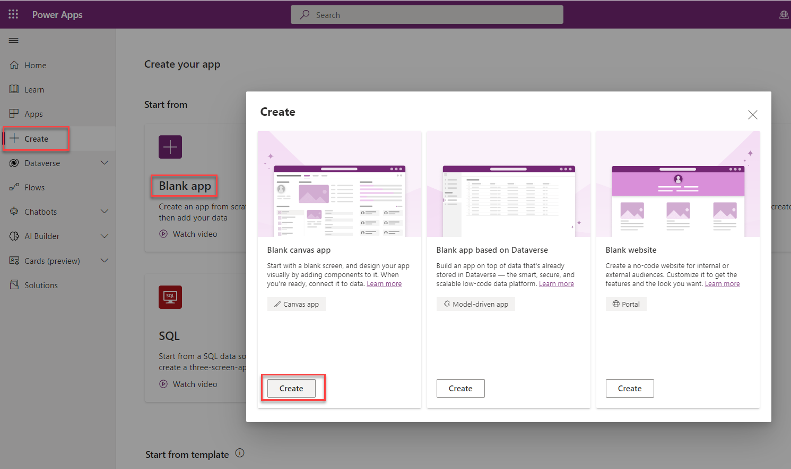
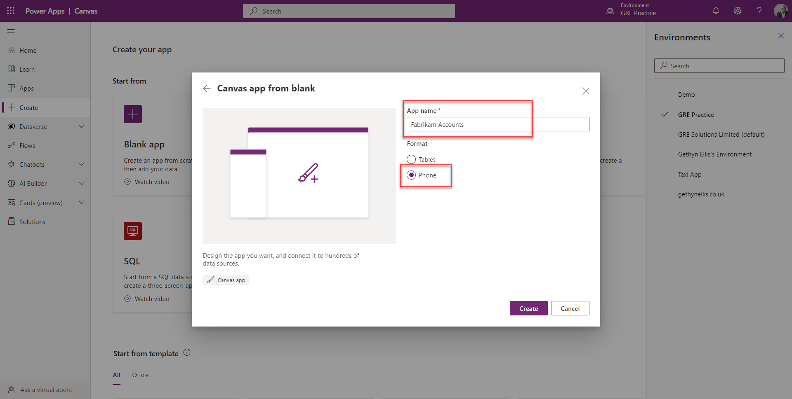
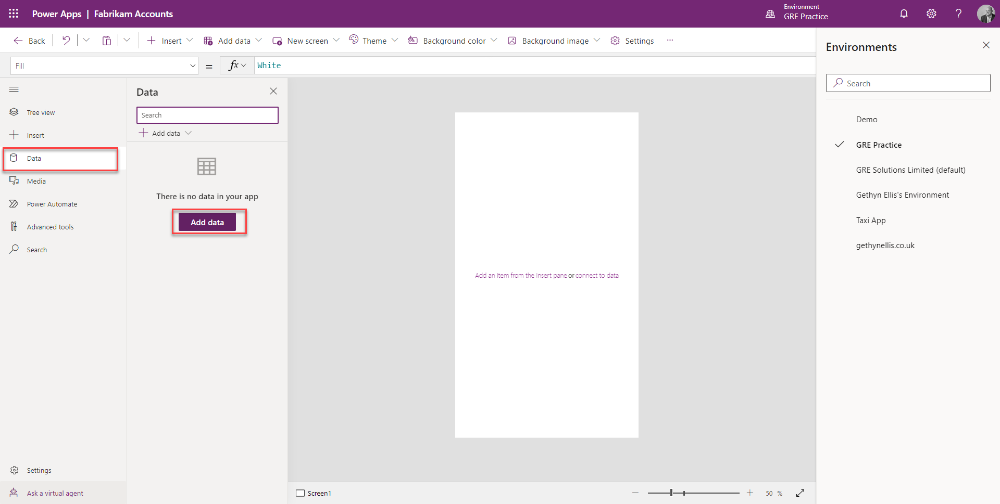
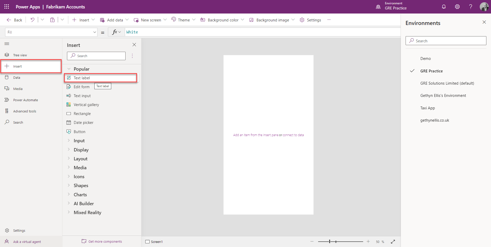
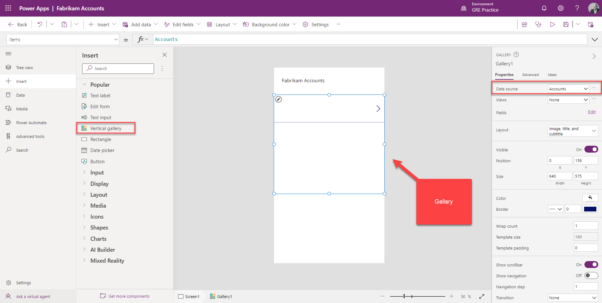
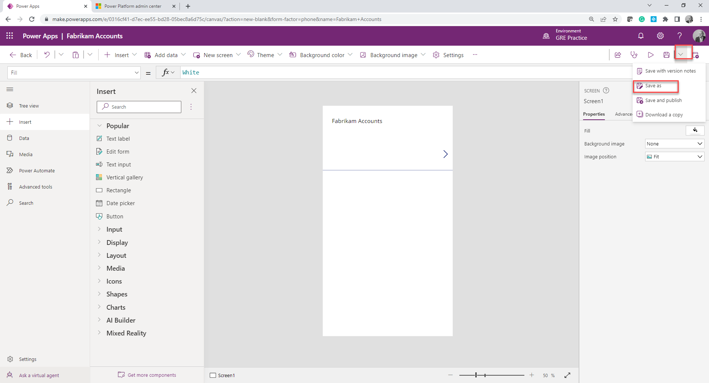

---
lab:
    title: 'Lab 2.1: Create an app'
    module: 'Module 2: Work with Dataverse'
---

Module 2: Work with Dataverse
=================================

## Lab 2.1: Practice Lab – Create an app

### Important Notice (Effective November 2020):
Common Data Service has been renamed to Microsoft Dataverse. Some terminology in Microsoft Dataverse has been updated. For example, entity is now table and field is now column. 

While the application is in the process of updating its user experience, some references to terminology like the Common Data Service (now **Dataverse**), entity (now **table**), field (now **column**), and record (now **row**) may be out of date. Please keep this in mind as you work through the labs. We expect to have our content fully up to date very soon. 

For more information and for a complete list of affected terms, please visit [What is Microsoft Dataverse?](https://docs.microsoft.com/en-us/powerapps/maker/common-data-service/data-platform-intro#terminology-updates)

## Scenario

You are a functional consultant for your organization Contoso. You are assigned
to work on a project for your client Fabrikam. Fabrikam would like to encourage
their employees to continuously learn. They want to build an application that
allow a small set of employees to create knowledge assessments and then make
them available to all employees to test their knowledge. The employees need to
be able to pick an assessment and quickly complete it in just a few minutes. In
this practice, you will be creating the apps necessary to support this effort.

Working with the solution architect on the project you have determined that you
will create two apps.

**Fabrikam Knowledge Admin** – this will be a model-driven application that you
can quickly enable creation of the knowledge assessments by the users.

**Fabrikam Knowledge** – this will be a canvas app that will be a custom user
experience making it easy to find the assessments and take them.

In this practice, you will be starting the creation of these applications and
will build them out as you progress through the course. You will also create one
of the template applications so you can see how easy it is to get started using
a “Make from data” template.

## Exercise 1 – Review Templates and Create App from Data

In this exercise, you will review the template and sample apps that are
available on the maker portal. You will also create an app using the Create from
data templates to see how quickly that can get a basic canvas app started.

### Task 1 – Review + Create templates/samples

If you have time, you can choose any of these and select Make It and explore on
your own.

1.  Navigate to <https://make.powerapps.com>. You may need to sign in again using your credentials if necessary.

2.  Switch to your **Practice** environment by using the Environment Selector in
    the upper right corner of the screen. (It will probably say **Contoso
    (Default)**.) Select your **Practice** environment from the list.
    
    

3.  Select **+ Create** from the left-hand navigation menu.

4.  Review the different apps that are available to use as both samples and
    starting templates.
    
      

### Task 2 – Create an app over data for Account

Starting a canvas app from data is a quick way to start a canvas app when the
goal is to have a list of data from a table.

1.  Select **Blank app**. 

2.  In the **Create** dialog box, Click **Create** under **Blank canvas app**.

      

3.  In the **App Name** dialog box, name your app **Fabrikam
    Accounts** and select **Phone** format.
    
      

4.  Click **Create** in the dialog. (You may be required to sign in again; enter
    your tenant credentials if necessary.)

5.  Your app should open in the designer. (You may get a few pop-ups first;
    close them or click **Skip**.)
    
       

6.  Select **Data** from the left bar and click **Add data**. From the list of
    tables, select **Accounts.**

7.  Add a header to your app by selecting the **+ Insert** button (the Insert button)
    on the left menu  and selecting **Text label.** Use the pane on the right side
    of the screen to enter **Fabrikam Accounts** in the **Text** field, then hit
    **Enter**. You can edit the size, font, and other attributes to customize
    the look and feel of the application.
    
     

8.  Add a list of accounts to your app by selecting the **+ Insert** button on the left
    menu  and selecting **Vertical Gallery** from the **Layout** section.

9.  A vertical gallery will be inserted into your app, and you will be prompted
    to select which data source it should pull from. Select **Accounts** from
    the pop-up.

10.  The application will load list of the accounts (it may be blank for now).
    Drag the gallery to fit the app or resize to your liking.
    
     

11. To preview your app, click **Play** (it will look like a Play button) in the
    upper right corner. Click the **X** in the top right corner to close the
    preview screen.

12. Click the dropdown next to the save button and select  **Save As**.

     

13. Enter **Fabrikam Accounts** in the **Name** box.

14. Click **Save**.

15. Explore the app as much as you want and then proceed to the next exercise.
    This app will be saved, and you can always revisit it later.

16. Close the **App Designer** by clikcing the **Back** button don't save the app again.

## Exercise 2 – Create the model-driven app

In this exercise, you will be creating the Knowledge Admin model-driven app. In
the data modeling module, you will be creating all the entities, so getting this
started will be easy.

### Task 1 – Create a model-driven app

1.  Go back to <https://make.powerapps.com>. Make
    sure to select your **Practice** environment from the environment selector list(It will probably say **Contoso
    (Default)**.)

2.  Click on **+ Create** and select **Blank app.** 
    
4.  In the **Create** dialog box, Click **Create** under **Blank app based on Dataverse**.

5.  Enter **Knowledge Admin** for Name and click **Create**. Click **Switch to classic**.

6.  Click the edit icon (it looks like a pencil) next to **Site Map**. *Note:*
    When you start a new app, you must edit the site map before you can run it -
    otherwise you will get an error. You need to add at least one item to the
    navigation.

7.  Click on the **New Area**.

8.  Enter **Administration** for **Title**.

9.  Select the **New Group**.

10.  Enter **User Admin** for **Title**.

11.  Select the **New Subarea**.

12. Select **Entity** for **Type**.

13. Select **User** for **Entity**.

14. Click **Save**.

15. Click **Publish**.

16. Close the sitemap editor by clicking **Save and Close**.

17. Click **Save** and then click **Publish.** After publishing, close the app
    designer by clicking **Save and Close**.

18. Select **Apps**.

19. The **Knowledge Admin** application you created should be listed. Open the
    **Knowledge Admin** application by selecting the row and clicking **Play.**

20. The **Model-Driven** application **Knowledge Admin** will load.

21. Open one of the **Users**.

22. The User form of the selected record will load.

23. Close the application.

## Exercise 3 – Create the Knowledge canvas App

In this exercise, you will be creating the Fabrikam Knowledge canvas app. We
will build out the detailed user experience in the upcoming canvas app module.

### Task 1 – Create a canvas app

1.  Go back to <https://make.powerapps.com> and make
    sure you are in your **Practice** environment.

2.  Select **Solutions** and open **Common Data Services Default Solution**.

    If you see a popup message with **Solutions have a new look**, close it.
    
3.  Click **+ New >> App >> Canvas App,**.

4.  Enter **Fabrikam Assessment** for **App Name** and **Tablet** for **Format**. 

5.  Click **Create**. Click **Skip** if you see a prompt before the designer loads.

6.  The Canvas App Designer will load. Hover over **Screen1** on the **Tree View** pane on the left navigation pane and click on the
    **…** button.

7.  Select **Rename**.

8.  Enter **Main Screen** and press the enter key. *Note:* It is always a good
    idea to give components meaningful names. It makes them easier to use as
    your application gets more complex.

### Task 2 – Add Header to the App

Part of making a good app is giving it a personality. We are going to keep
things simple here and just add a basic header to the app.

1.  Select the **Insert** tab at the top of the screen.

2.  Click **Label**.

3.  A label will be added to the screen. Select the label.

4.  Next to **Label1**, click on the
    edit icon (it looks like a pencil) and click **Select to Rename**. Rename the label **Header Label**. Hit **Enter** on your keyboard.

5.  Select the **Properties** tab and change the **Font Size** to **28.**

6.  Click **Text Alignment** and select **Align Center**.

7.  Click **Color** and change color to **White**. 

8.  Change the **Fill Color** to **Blue**.

9.  Locate the **Position** section on the Properties window.

10. Enter **0** for **Y** and **0** for **X**.

11. Locate the **Size** section.

12. Enter **1365** for **Width** and **60** for **Height**.

13. Double click on the **Text** of the label.

14. Replace **Text** with **Fabrikam Assessment**.

### Task 3 – Add User Name to the Header

In this task, you are going to leverage the User information to add the name
of the current user to the header.

1.  Select the **Main Screen** in the left control tree.

2.  Select the **Insert** tab from the top menu and click **Label.**

3.  Rename the label **User Label**.

4.  Make sure text **Text** property is selected and the function value (in the
    top menu, where you see fx) is now **“Text”.**

5.  Replace **“Text”** with the following:

~~~~~~~~~~~~~~~~~~~~~~~~~~~~~~~~~~~~~~~~~~~~~~~~~~~~~~~~~~~~~~~~~~~~~~~~~~~~~~~~
   User().FullName
~~~~~~~~~~~~~~~~~~~~~~~~~~~~~~~~~~~~~~~~~~~~~~~~~~~~~~~~~~~~~~~~~~~~~~~~~~~~~~~~

**Note:** Make sure there should not be any quotation mark when you replace the text property value to **User().FullName** .

6.  The user’s Full Name will now be displayed on the label. Select the **Home**
    tab and make sure the text box is selected.

7.  Change the **Font Size** to **14**.

8.  Change the Font **Color** to **White.**

9.   Click **Text align** from the Properties tab on the right and select **Align right.**

10.  Set **Position Y** to **0**.

11.  Locate **Size** and set the Height to **60**.

12.  Locate **Padding** and enter **10** for **Right**.

13.  Click **File** and select **Save**.

14. Click on the **Back** button.

15. Click **Play**. Click **OK** if you see a prompt before the designer loads.

16. Your application will load.

17. Close the preview.

18. Close the Canvas App Designer.

19. Click **Leave**.
